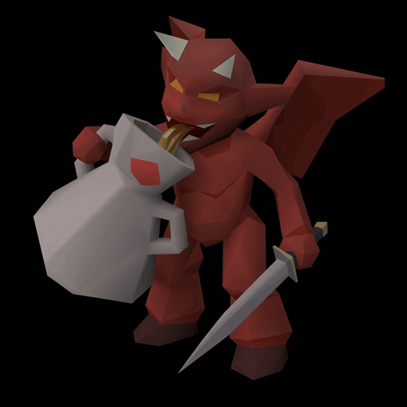

<p align="center">
  
</p>

# Wine to 99

A RuneLite sidebar plugin for tracking a wine-making grind to level 99 Cooking.

## What it tracks

- Successful jugs of wine still needed for exactly 13,034,431 Cooking XP.
- Unfermented wines currently in your inventory and most recently opened bank.
- Potential banked Cooking XP from the currently fermenting wines.
- Grapes and jugs of water in the most recently observed bank contents.
- Wines mixed per active hour, including both fermenting and finished wines.
- Potential Cooking XP per active hour at 200 XP per wine mixed.
- Estimated time until 99 at the current production rate, shown as `DD:HH:MM:SS`.
- Session wine, XP, and elapsed-time totals.

The remaining-wine count immediately subtracts the current fermenting batch. If
a wine becomes bad wine and awards no XP, it naturally returns to the remaining
total when the batch finishes.

## Run it locally

1. Install a Java 11 JDK and IntelliJ IDEA.
2. Open this folder as a Gradle project.
3. Run `gradlew.bat run` from PowerShell, or run the `run` Gradle task in IntelliJ.
4. Enable **Wine to 99** in the development RuneLite client's plugin list.
5. Click the jug-of-wine button in the RuneLite sidebar.

Jagex accounts need the official RuneLite development-client login setup:
https://github.com/runelite/runelite/wiki/Using-Jagex-Accounts

## How tracking works

RuneLite does not expose the wine fermentation timer as a varbit. The plugin
therefore follows RuneLite's existing Cooking plugin convention and tracks the
unfermented item batch for the 21-tick fermentation window. It combines the
inventory with the last bank contents the client has observed, so depositing a
batch does not lose it from the count.

Open your bank once after logging in to populate the grape and jug-of-water
metrics. They then update whenever RuneLite receives another bank change.

Wines per hour counts each wine as soon as it is mixed and does not remove it
when it finishes fermenting. Cooking XP per hour is that production rate at 200
XP per wine. Below level 68, the value is prefixed with `~` because wines can
still fail. Time starts when the first wine is mixed, pauses while logged out,
and can be restarted with **Reset session**.

## Verify before publishing

Run the automated checks:

```powershell
.\gradlew.bat clean test
```

Then test in game:

- Mix an inventory and confirm the fermenting number rises.
- Bank it and confirm the count remains stable.
- Let it ferment and confirm successful wines and both hourly rates update.
- At Cooking levels below 68, confirm failed wines are not counted as successes.
- Hop worlds and confirm session totals remain while the live batch is rebuilt.
- Use **Reset session** and confirm only session statistics reset.

To publish, create a public GitHub repository and follow RuneLite's Plugin Hub
submission guide: https://github.com/runelite/plugin-hub#creating-new-plugins
